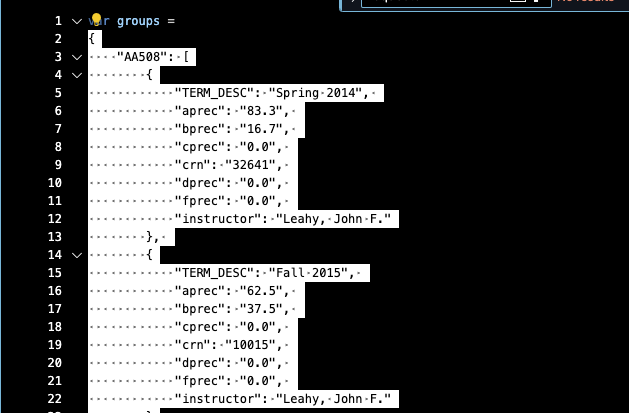
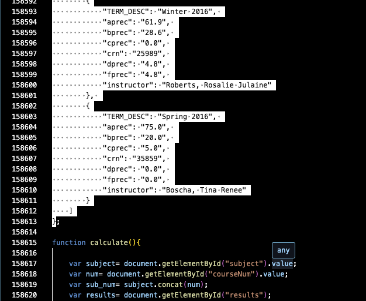

# Instructions for Administrator System Usage
## Project 1 for CS422, Winter 2024
### Written by Luke Marshall 2/2/2024
##### Simone Badaruddin, Erin Cohen, Isabella Cortez, Nithi Deivanayagam, Luke Marshall

The function of the admin system is to allow an administrator to replace the grade data collected from the University of Oregon. The system additionally allows the admin to view discrepencies in the names between those found on the web and those in the grade data. The faculty names are used to limit the data being graphed in the user application to only that of the faculty in the natural science departments if a user so chooses.

## Dependencies

The local dependencies include the `data_maintainer.py` and `Webscraper.py` files that should be in the `application` directory. If those files are not included in the downloaded package, please re-download the package and see that they are included.

The modules are only guaranteed to work if using Python versions 3.10-3.12.

NOTE: below you are instructed to use the `pip` command. If you are getting an error when this is attempted, you may need to use `pip3` in its place.

### The `data_maintainer.py` file includes its own dependencies that must be accounted for:

It is necessary to check for required libraries in the directory and install them if they are not found. Make sure you are in your terminal, in the `application` directory.

1. The data maintainer file requires the use of regular expressions to filter the grade data for the data that is related to the natural science departments, the re library is used to do this:
    - Type `pip show re` into the command line of the terminal and hit enter.
    - If nothing appears, use `pip install re` to install the regex library.

2. The data maintainer file requires the use of json file functionality to access the grade data and the faculty list, the json library is used to do this:
    - Type `pip show json` into the command line of the terminal and hit enter.
    - If nothing appears, use `pip install json` to install the json library.

3. The data maintainer file requires the use of a similarity checker when comparing faculty names found via web scraping and the names in the filtered grade data:
    - difflib, which is used for this purpose, is part of the Python standard library and does not need to be installed.

### The `WebScraper.py` file includes its own dependencies that must be accounted for:

It is necessary to check for required libraries in the directory and install them if they are not found. Make sure you are in your terminal, in the `application` directory.

1. The web scraper file requires the use of web and URL functionality to go to the required natural science department pages and scrape the faculty names, the requests library is used to do this:
    - Type `pip show requests` into the command line of the terminal and hit enter.
    - If nothing appears, use `pip install requests` to install the requests library.

2. The web scraper file requires the use of web scraping in order to find a collect the names of faculty, the bs4 library is used to do this with BeautifulSoup:
    - Type `pip show bs4` into the command line of the terminal and hit enter.
    - If nothing appears, use `pip install bs4` to install the bs4 library.

3. The web scraper file requires the use of json file functionality to store the scraped faculty names into a file, the json library is used to do this:
    - Type `pip show json` into the command line of the terminal and hit enter.
    - If nothing appears, use `pip install json` to install the json library.

4. The web scraper file requires the use of timing functioanlity to avoid detection during web scraping, the time library is used.
    - The time library is part of the Python standard library and does not need to be installed

## Usage

### Step One: Replace data in `grade_data.json`
1. Take the file in the format of `gradedata.js` and replace it with the new `gradedata.js` which has the new grade data.
2. Open the new `gradedata.js` file.
3. Highlight the text found inside from the first curly brace around the data, after the equals sign; to the last curly brace, before the ending semicolon. Do not include any spaces or characters before or after the first or last curly brace. Images have been included below to illistrate the process.

4. Copy the highlighted text using Ctrl-c
5. Open the `grade_data.json` file.
6. Make note of the format of the data inside. Delete all the contents of the file.
7. Paste the new grade data into the file, making sure that it matches the format of the data that was deleted.

### Step Two: Run the `Admin.py` Module
1. Type `Python Admin.py` into the command line, and hit enter
    - `Python3 Admin.py` may be required if nothing happends or an error appears
    - Ensure you are running this with the terminal inside of the `application` directory
2. Wait 2-5 minutes for the web scraper to complete and come up with the scraped list of natural science department faculty.
3. When prompts start to be printed, answer them according to the instructions given in the prompt
    - This process will link names in the grade data to names garnered from the web scraping.
    - The outcome of this will be that the grade data will have the names somewhat as they are on the web
4. An automatic process will adjust the names in `faculty_names.json` to better match those in the grade data, please wait until a prompt lets you know this process is finished before moving on.

### Step Three: Test the User side
With the data now updated, see `USER.md` for directions on how to use the EasyA system and try out a few different graphs to make sure the data replacement works. If it does not work, make sure you have replaced the data in `gradedata.json` exactly according to the instructions.