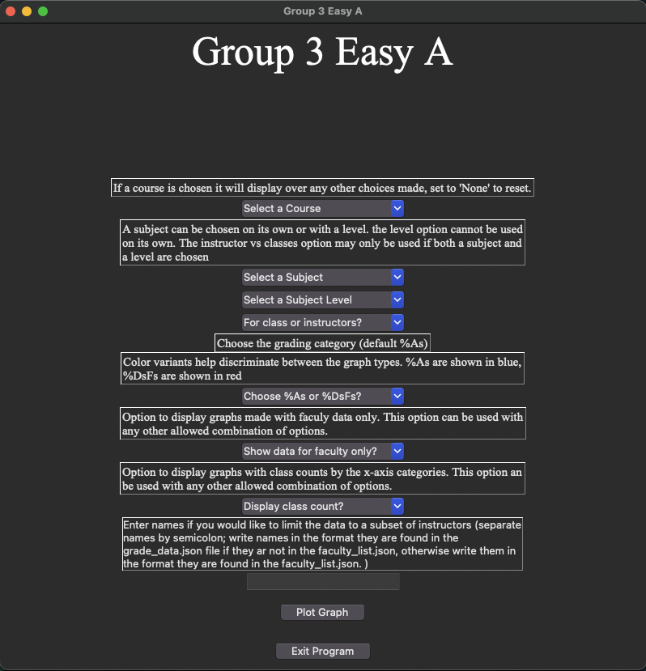

# Programmers Documentation for the EasyA_application Module
## Project 1 CS422 Winter 2024
## Written 2/4/2024 by Luke Marshall
##### Simone Badaruddin, Erin Cohen, Isabella Cortez, Nithi Deivanayagam, Luke Marshall

## Dependencies

The local dependencies include the `data_maintainer.py` and `Grade_grapher.py` files that should be in the `application` directory. If those files are not included in the downloaded package, please re-download the package and see that they are included.

The modules are only guaranteed to work if using Python versions 3.10-3.12.

NOTE: below you are instructed to use the `pip` command. If you are getting an error when this is attempted, you may need to use `pip3` in its place.

### The `EasyA_application.py` file includes its own dependencies that must be accounted for:

It is necessary to check for required libraries in the directory and install them if they are not found. Make sure you are in your terminal, in the `application` directory. 

1. The EasyA application file requires the use of a tk interface to create the user interface, the tkinter library is used to do this:
    - tkinter, which is used for this purpose, is part of the Python standard library and does not usually need to be installed
    - If you are using a Mac and the tkinter library is installed, but the application does not run, try using `brew install python-tk` in your terminal.

2. The EasyA application file requires the use of json file functionality to access the faculty list, the json library is used to do this:
    - Type `pip show json` into the command line of the terminal and hit enter.
    - If nothing appears, use `pip install json` to install the json library.

3. The EasyA application requires the use of image functionality to open graph images after they have been created, the pillow library is used for this purpose.
    - Type `pip show Pillow` into the command line of the terminal and hit enter.
    - If nothing appears, use `pip install Pillow` to install the json library.

### The `Grade_grapher.py` file includes its own dependencies that must be accounted for

It is necessary to check for required libraries in the directory and install them if they are not found. Make sure you are in your terminal, in the `application` directory.

1. The `Grade_grapher.py` file requires the use of graphing capabilies to create and produce the graphs, the matplotlib library is used for this purpose
    - Type `pip show matplotplib` into the command line of the terminal and hit enter.
    - If nothing appears, use `pip install matplotlib` to install the json library.

### The `data_maintainer.py` file includes its own dependencies that must be accounted for:

It is necessary to check for required libraries in the directory and install them if they are not found. Make sure you are in your terminal, in the `application` directory. 

1. The data maintainer file requires the use of regular expressions to filter the grade data for the data that is related to the natural science departments, the re library is used to do this:
    - Type `pip show re` into the command line of the terminal and hit enter.
    - If nothing appears, use `pip install re` to install the regex library.

2. The data maintainer file requires the use of json file functionality to access the grade data and the faculty list, the json library is used to do this:
    - Type `pip show json` into the command line of the terminal and hit enter.
    - If nothing appears, use `pip install json` to install the json library.

3. The data maintainer file requires the use of a similarity checker when comparing faculty names found via web scraping and the names in the filtered grade data:
    - difflib, which is used for this purpose, is part of the Python standard library and does not need to be installed.

## Usage 
After the dependencies have all been downloaded, the EasyA application may be initialized. In order to do so, make sure you are in your terminal in the `EasyA/application` directory.

1. First, type `Python EasyA_application.py` into the terminal. If an error comes up, you might try using `Python3` in your command instead. At this point the EasyA interface should appear on the screen as it is in the image below. 

If the interface opens and you do not see the `Plot Graph` and `Exit` buttons at the botton of the interface, use your mouse to click and drag one of the corners down to reveal what is hidden.

2. Choose graphing options that suit your needs. In order fromtop to bottom:
    - The courses dropdown allows you to select any course in the natural science department.
        - choices here supercede any conflicting choices made in subject, level, or class; so there is a `None` option to reset the dropdown without having to close the interface.
    - The subject dropdown allows you to choose from any of the subjects in the natural science departments
    - The subject level dropdown allows you to choose which level (1-6)00 you would like to specify for a subject to be graphed
        - must be used at least in tandem with a subject choice
    - The class or instructors dropdown allows you to choose what the x-axis variable should be when graphing a subject and level, either classes in that subject and level, or instructors who taught classes in the subject in that level
        - Must be used with the subject and level dropdowns
    - The grade percentages dropdown allows you to choose which of the twop grading percentages, either by As or by Ds and Fs, the graph y-axis variiable should be
        - Either option works with any of the aforementioned allowable graphing options
        - A choice of %As produces a bar graph with descending blue bars, and a choice of %DsFs produces a bar graph with ascending red bars; this helps denote the difference in what is usually sought after in a class or instructor
    - The faculty dropdown allows you to specify whether the graphs should only include data for the faculty members in the natural science department, or everyone who taught in the departments during the years the data was collected.
        - Either option works with any of the aforementioned allowable graphing options
    - The class count dropdown allows you to choose if the x-axis variables (instructors or class) should have either the number of classes that the instructor taught, or the number of times that class was taught that the data was garnered from.
        - Either option works with any of the aforementioned allowable graphing options

3. The text box at the bottom is if you would like to further specify a subset of instructors that you would like represented in the graphing. If any names are enterered into the text box, they should be separated by semicolons. They will be the only names that appear on any graphs produced, so many graphing options will produce a blank graph unless the choices made include the instructor specified.
    - Any names typed into the box should be exactly as they appear in the gradedata.json file (using Ctrl-f and searching the first or last name of the instructor will be the easiest way to find this representation)
    - If the faculty dropdown is used to choose faculty-only, the names will be further filtered by if they are in the faculty list 

4. Press the `Plot Graph` button on the bottom of the screen
    - This will produce the graph as requested as a pop-up image

5. Exit out of the graph when you are done with it and either press the `Exit` button or choose other options and plot another graph.

6. If you choose to press the `Exit` button a popup will ask you if you would really like to leave the application. 
    - choosing no will close the popup and the interface will remain available
    - choosing yes will result in the interface closing and the program ending
 
**Troubleshooting**: If you hit the `Plot Graph` button and the graph image fails to appear, enter back into your `EasyA/application` directory. The images will be saved in the directory as `As_graph.jpg` and `DsFs_graph.jpg`. Double click either one to view the version most recent graph requested.

## Implementation

Each of the dropdowns has a default text which is displayed within the dropdown itself, and some have a 'None' option. When the `Plot Graph` button is pressed, it calls the `Graph_choices` function which takes the input from each of the dropdowns and, if necessary such as with the dropdowns with two options, transforms the input into more useable assignments, but which still denote the same meaning. The inputs are then sent through conditional branching in the form of an if loop and depending on what input was made by the user, the corresponding Grapher object is created. 
- The input to object creation is such:
    - If a course is selected, the Courses_By_Prof_Grapher object is created
    - If a subject is selected without a level, the Subjs_By_Prof_Grapher Grapher object is created
    - If a subject and level is selected without choosing a class vs instructor option or if the instructor option is chosen, the Subjs_And_Level_By_Prof_Grapher object is created
    - If a subject and level is selected and the class option is selected in the class vs instructor dropdown then the Subjs_And_Level_by_Class_Grapher is created

This allows for other arguments, level and category, to be set by the input, independent of the object creation, and then passed into a single `graph_data` method call regardless of the Grapher object created. The Grapher object then automatically parses the data as it is implemented to do in its `parse_data` method. The singular `graph_data` method call then uses whichever object was created to then create the graphs. Graphs whicvh represent the same set of inputs independent of the grade percentage choice from the dropdown are then created and placed in the directory as `As_graph.jpg` and `DsFs_graph.jpg`. The user input from the grading choice, if one was made or not, determines the graph that will open as a popup as a result of the `Plot Graph` button being pressed via opening and showing that image. The image may then be closed using the usual red x in the upper corner. This allows for the ability to graph again. In the case where the `Exit` button is clicked, the `exit` function will be called. This function produces a message popup box with a prompt as to whether or not the user would like to actually exit the program. If no is clicked then the program continues as if nothing happened. If the yes box is clicked it caused the interface and program to terminate immediately.
